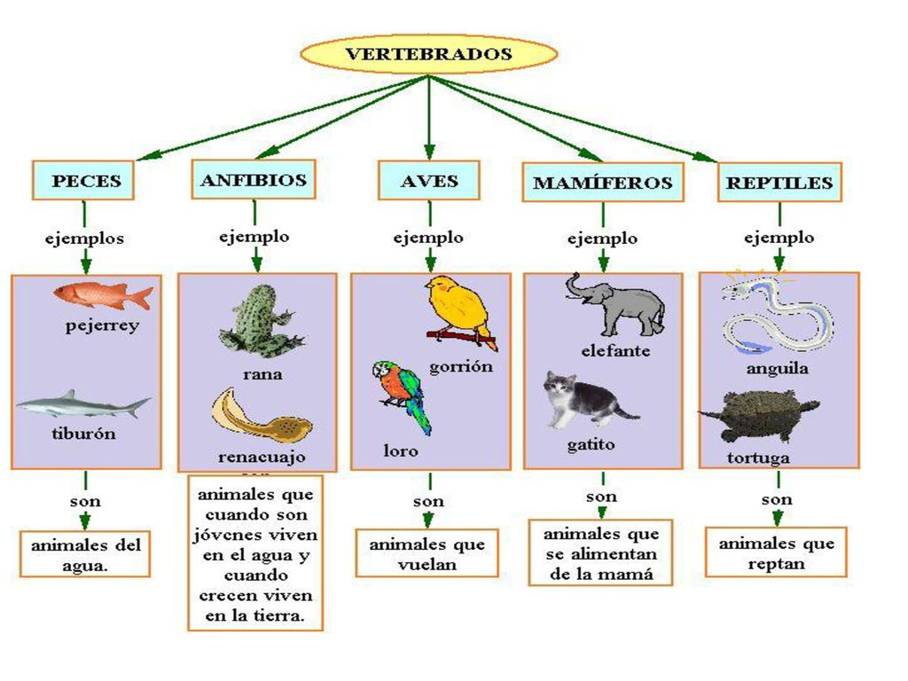

# Inheritance

I'm developing [this](https://github.com/ehguille/programacion-java/tree/main/src/herencia) to show how inheritance works in Java. I'm taking the following image as reference (although I've also included a Ornitorrico ---spanish for platypus--- class to demonstrate that there are mamals that also are oviparous.

## Attribution

The species tree shown before has been released by Lucas Naranjo Contreras [here](https://slideplayer.es/slide/13657384/).
